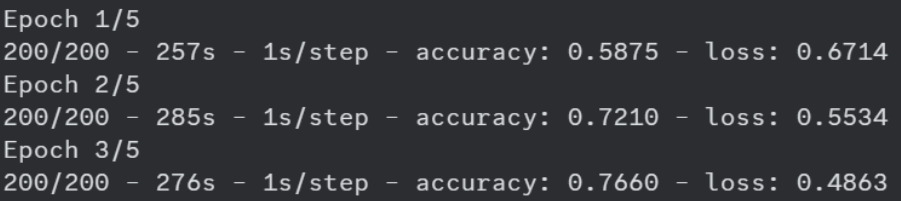
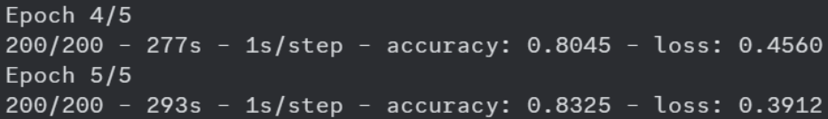
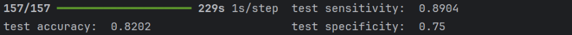
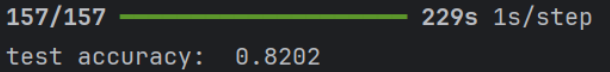
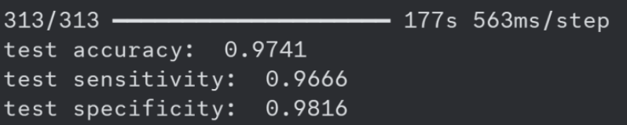
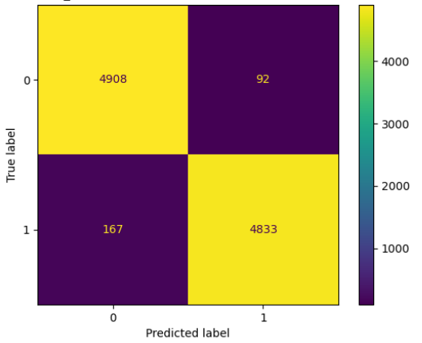

# RealText: AI generated text detector
This project was created as part of SFWRENG 4AL3. The follwing is a detailed report on the tool and its development process.

## Milestone 1

### Team information: contributors

[Alexander Bartella](https://github.com/abartella02) - McMaster University Mechatronics Engineering 2025 
[Jacqueline Leung](https://github.com/jacquelineleung) - McMaster University Mechatronics Engineering 2026  
[Rayhaan Datoo](https://github.com/raydatoo) - McMaster University Mechatronics Engineering 2025

### Context

The problem identified is the difficulty of discerning AI generated content from organic, human
generated content. With the increased availability of power LLMs like ChatGPT, outsourcing tasks like
schoolwork to AI has become very common. Schools and workplaces need a way to combat this by identifying
content not generated by a human.

This is a challenging problem because AI is getting better at writing text that could pass off as human
created. Even humans can have trouble differentiating between content generated by AI and content generated
by humans. Although dystopian, this problem can be solved with the help of machine learning. We can use a
neural network to analyze snippets of text to predict if they are AI or human generated.

The tool we are proposing will allow teachers, professors, and other professionals to easily identify AI-
generated text. This will help them make more informed decisions about how to identify this kind of plagiarism,
rather than making “educated guesses”, thereby reducing false positive and false negative plagiarism claims.

This is relevant to the world as AI will continue to grow and be used in various environments. As AI
becomes more easily accessible, it is likely there will be more AI generated content and works. This project
would ensure work is human generated, helping maintain integrity in places such as schools, universities, and
workplaces.

### Dataset

For this task, we will use the [“Augmented data for LLM” dataset on Kaggle](https://www.kaggle.com/datasets/jdragonxherrera/augmented-data-for-llm-detect-ai-generated-text?select=final_train.csv), which was created for the “LLM -
Detect AI Generated Text” competition organized by Vanderbilt University. The original aim of the competition
was to create a model that can identify AI generated essays. The dataset we are using contains text selections
from various human and AI generated essays, the average length of a snippet being around 400 words. There are
346977 unique samples in the dataset. We will most likely only use a subset from this dataset to train our model,
as well as possibly reduce the length of each snippet. We also plan on adding to the feature set by computing
features such as unique word proportion, average sentence length, and other metrics.

### Proposed Solution

This is a predictive problem, as we are trying to predict Variables involved as features are the words themselves,
evaluated as N-grams with TF-IDF, average sentence length, unique word ratio, and stop-word frequency.
Additional metrics may be used to expand the feature set. The target variable is a binary label indicating 1 for
AI generated, and 0 for human generated.

We chose to train a convolutional neural netwoek, as it has been shown to be effective in analyzing the sentiment of a text [1] as well as detecting
phishing/scam emails [2], which is a task similar to the one in this problem. We will be selecting a subset from
the dataset to train on, as the dataset is very large. Of this subset we will split it 80-20 into a training set and test set. This data will be preprocessed using the Word2vec and/or gloVe [3] technique to represent our text samples
as vectors, to be processed by the CNN. We will document these results using a confusion matrix, evaluating
them primarily using accuracy.

This strategy is optimal as our problem is one of a binary classification, and a confusion matrix is a
concise and readable way of displaying the effectiveness of our model. The inspiration for this problem comes
from the growing trend of identifying human texts from AI texts. In an MIT Technology Review article [4], the
author described the trend and growth of AI texts and the various ways scientists and developers have been
developing to differentiate between the two. It is also apparent that this is an emerging problem, as there is a
game site called “human or not” [5], where users will decide if the text on the screen was human or AI
generated. The fact that there is a game for this indicates it is not straightforward and simple to differentiate AI
text from human text.

Existing solutions include the Giant Language Model Test Room, which improved human detection of
fake text from 54% to 72%. This is a visual tool that highlights text passages to determine if text likely human
or AI generated. The three tests used to determine if the text is human or AI generated are probability of the
word, absolute rank of the word, entropy of the predicted distribution [6].

### References

[1] https://www.sciencedirect.com/science/article/pii/S

[2] https://siiet.ac.in/wp-content/uploads/2023/12/46.A-Case-Study-on-Deep-Learning-in-Fraud-Detection_compressed.pdf

[3] https://www.alpha-quantum.com/blog/word-embeddings/introduction-to-word-embeddings-word2vec-glove-fasttext-and-elmo/

[3] https://www.technologyreview.com/2022/12/19/1065596/how-to-spot-ai-generated-text/

[4] https://www.humanornot.ai/

[5] https://aclanthology.org/P19-3019/

## Milestone 2

### Refined Problem
The problem identified is the difficulty of discerning AI generated content from organic, human
generated content. This is a challenging problem because AI’s ability to write text that could pass off as organic
is improving. We can use a neural network to analyze snippets of text to predict if they are AI or human
generated. This will help teachers and professionals make more informed decisions when identifying
plagiarism, rather than making “educated guesses”, reducing false positive and false negative plagiarism claims.
This is increasingly relevant as AI rapidly becomes more accessible and is integrated into more environments.
Libraries we used include **Pandas**, **NumPy**, **TensorFlow**, **sklearn**, **kagglehub**, and **gensim**

### Dataset
The dataset we used is the “Augmented data for LLM” dataset on Kaggle, which was created for the
“LLM - Detect AI Generated Text” competition organized by Vanderbilt University. This dataset we are using
contains text selections from various human and AI generated essays, the average length of a snippet being
around 400 words. Both train and test datasets have the text in one column and the label in another. In the
final_train.csv set, there are 346977 samples, 124823 are AI generated and 222154 are not. In the final_test.csv
set, there are 86587 samples, 30742 are AI generated and 55845 are not. We took a subset from each dataset,
taking an even number of each class. For training we selected 2000 samples, and for testing, we selected 1000
samples.

### Preprocessing
As the dataset we were using was quite large, we needed to take a subset of the dataset on which to train
our model. Our sampling strategy involved dropping datapoints (text samples) that contained illegal characters
(such as emojis) and ensuring an equal number of positive and negative labels were selected to eliminate class
imbalance. For this milestone, we settled on using 2000 training samples (1000 of each class) and 1000 test
samples (500 of each class).
Once our dataset was created, we further processed each individual datapoint to get rid of tabs, line-
breaks, and unnecessary spacing, which ensured that our embedding model would have no issue when
processing our data.
The next step was to feed the datapoints into an embedding model so that our text samples could be
converted into a numerical representation. For this we used Word2Vec, specifically the “google-news-300”
model, which contains 3 million English words. Once we had our data points in a numerical form, we were now
ready to start training the model.

### Model Specifications
Because we were working with sequential data, where the relation of each word to its neighbors is an
important feature for the classification, we decided on using a supervised **recurrent neural network,** more
specifically a **bi-directional LSTM**. LSTM’s have the advantage of not being victim to the vanishing gradient
problem (as learned in class) which makes them ideal for tasks where our inputs are long sequences. We are also
using a bi-directional LSTM as they consider both previous and future values in the sequence, which will help
our model analyze sentence structure more effectively. Note that this would be a supervised model as we are
training using labelled data.
In addition to the class notes from week 12, we also used [1] and [2] to help build our model. Our LSTM
consists of 4 layers (hyperparameters are coloured in red):

**Embedding layer:** This is our first layer that converts our numerical representation of the text samples from
integers into arrays of floats. Instead of using our own, we are embedding the pre-trained word2vec layer
trained on Google News, which has a dimension of size 300.

**Bidirectional layer:** The second layer which handles the bulk of the computation. As it is bi-directional it
consists of both forward and backwards passes. Given this, although the output size is set to be that of the
embedding layer, it returns double the size (concatenation of forward and backward passes) for a total of 600.

**Dense layer:** Our first fully connected layer, that takes an input size of the bidirectional layers output (600) and
with the use of the ReLU activation function returns a dimension of size dimension of size 300. ReLU
introduces non-linearity to the model, which helps capture the complexity of sequential text data.

**Output layer:** Our final layer is another fully connected layer that takes input of size 300 from the previous
layer and uses the sigmoid activation function to return a value between 0 and 1, corresponding to the
probability that our datapoint is of the positive class or not. If the returned value is greater than 0.5, our model
predicts that the given text is AI generated.
The other specifications of our model include the number of epochs we used ( 5 ), our batch size (1 0 ), and
our selected loss function (Binary cross entropy loss). For milestone 2, we did not include a regularization
technique as we plan to use early stopping in milestone 3 to help prevent overfitting. Finally, our model’s
training progress will be tracked using accuracy and loss functions provided by TensorFlow, which calculate the
loss and accuracy on our full training set per epoch.

### Evaluation
Evaluation of our model will be based on how well it performs on the pre-defined test set. On Kaggle,
there were two separate datasets, one for training and one for testing. By having two completely isolated
datasets, it helps ensure we are not missing out on noticing potential issues such as under and overfitting.
During training we will be monitoring the loss and accuracy on the entire training set (as this is a
computation heavy neural network, we cannot do cross validation). During testing we will be evaluating the
**accuracy** , **sensitivity** , and **specificity** of the model on the test set. These three parameters should give us a good
overview of the model’s performance and make sure the model is not overfitted or biased towards one class.

### Preliminary Evaluation
#### Training

#### Testing

### Limitations
At this point our major limitation is time and computational power. While we would like to train with
more samples, we are currently limited to 2000. Training with this many samples is taking our system
approximately 25 hours. With more time and computer power we could train our model with more data,
theoretically resulting in a lower rate of overfitting and overall higher accuracy.

## Milestone 3

### Preprocessing Improvements
We implemented two main changes in the way we preprocessed our data: increasing the size of our
dataset and implementing lemmatization. Note that our original pre-processing process from milestone 2
already removed class imbalances and cleaned the text data.
The first improvement was to increase the size of our training data to provide our model with more
information. We increased the number of training samples from 4000 to 20000. More training data means our
model is better equipped to classify new sequences, as well as reduces the chance of our model overfitting.
The second improvement was to implement lemmatization. Lemmatization is the process of reducing a
word to its base form, for example running -> run [ 5 ]. By reducing all the words to their base forms, it allows
the model to focus on the semantics of the text samples instead of getting distracted by the noise caused by
different forms of the same word.

### Model Specification Improvements
While we did attempt to tweak our model specifications, nothing we did gave much of a noticeable
improvement, likely due to the fact that we had experimented with our parameters (batch size, epochs, etc.) and
layer depths/dimensions during milestone 2.
Our only improvement that made a significant impact was implementing early stopping to stop training
once our training accuracy stopped improving. Not having early stopping was one of the major reasons for our
lower accuracy in milestone 2 as our model was likely overfitting on the training data and performing sub-
adequately on the test data. By implementing early stopping we saw significant improvements during testing.

### Evaluation
Due to our model being an RNN, we cannot use cross validation methods like LOOCV or K-folds to
evaluate our model. Our evaluation is based on how well our model performs on the pre-defined test set we
downloaded from Kaggle. We tested for accuracy, sensitivity, and specificity to ensure that our model was
performing as intended.

Our original model (milestone 2) had an accuracy score of 82% on the test data set.

After our pre-processing and model improvements, our new model performed much better on the test set:

Our final model has a test accuracy of 97%, indicating it is strong at
classifying the data. The final model also has high sensitivity and specificity rates but may still be slightly biased based on the number of false positives and false negatives.
There were an even number of each class in the test samples, so it is expected the number of false classifications
of each class would be similar, but the number of false negatives came out to be greater than the number of false
positives. This indicates the model has slightly more trouble classifying the AI generated text and could be due
to the structure and word usage in the paragraphs of these data. Although there is a difference between the
number of false positives and false negatives, the test sensitivity is 96.6% and test specificity is 98.1%,
indicating this bias is not a major issue. Overall, the model is a well-performing model as accuracy, sensitivity,
and specificity are all greater than 96%.

### Limitations
Like most personal ML projects, our project faced limitations due to constraints on time and computing
power. More time/compute power would allow us to train on more samples and increase the accuracy of our
model.
Specific to the implementation of our project however, was also a limitation that could not have been
solved just by letting it train for longer, and that was limitation on the RAM due to the dimensions of our
RNN’s layers. Our layers had dimension sizes of up to 900 million weights. Coupled with the fact that this was
an RNN/LSTM, which has to also store data of sequences, our method of determining dimension sizes was
focused less on what would make our model more accurate, and more on what would not cause our model to
crash during training due to insufficient memory.

### References

[1] Geeks for Geeks: RNN for Text Classifications in NLP https://www.geeksforgeeks.org/rnn-for-text-classifications-in-nlp/

[2] TensorFlow: Text Classification with an RNN https://www.tensorflow.org/text/tutorials/text_classification_rnn

[3] Importing and using pre-trained word2vec models with Gensim https://radimrehurek.com/gensim/models/word2vec.html https://radimrehurek.com/gensim/models/keyedvectors.html

[4] Slim word2vec model based on Google-News-300 https://github.com/eyaler/word2vec-slim/

[5] Spot Intelligence: How to Implement Lemmatization in Python [Spacy, NLTK, & Gensim] https://spotintelligence.com/2022/12/09/lemmatization/
